Fair warning, this is mostly just an excuse for me to play with OpenSCAD, a lovely little programming based CAD software.

The first thing to do is to imagine our dice have infinite sides, and each side is represented by a integer along some axis in n-space. We'll work with 3d spaces (so rolling 3 dice) for examples. 

We can imagine the lowest possible roll (1,1,1) as being contained by a unit cube:

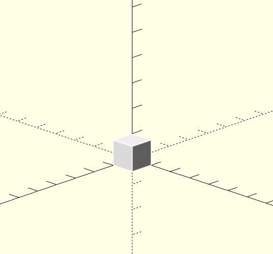

For the next lowest roll, we can increment any of the dice in the previous lowest roll by 1, giving us (2,1,1), (1,2,1), and (1,1,2). We plop unit cubes of those rolls down at those coordinates. 

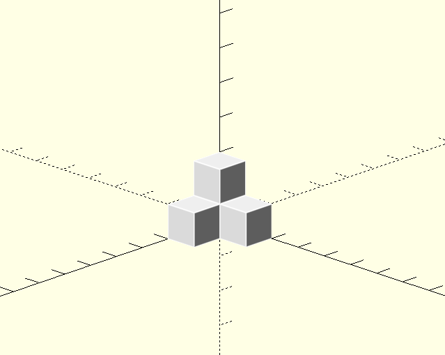

For the next lowest roll, we do the same thing: we take the previous set of lowest rolls and increment any particular die by one. We will have some repetition this time around; we're only interested in the unique rolls. We get (3,1,1), (2,2,1), (2,1,2), (1,3,1),(1,2,2) and (1,1,3)

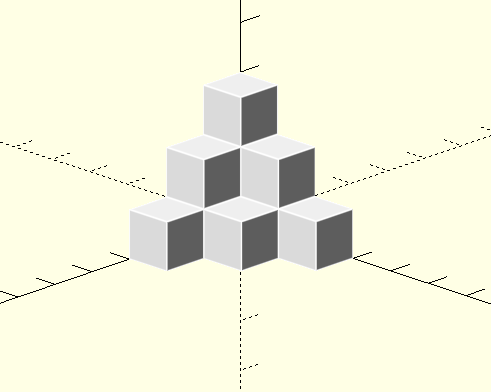

Intuitively, it's easy to see the volume containing these rolls is an n-simplical number, in this case a 3-simplical number (where a 2-simplical number would be a triangular number). We can calculate the volume containing a particular roll by calculating the n-simplical number associated with it. There are a number of ways to calculate n-simplical numbers, we'll use this definition in python:
$$S(n,x) = \prod_{i=0}^{n-1}\frac{(x + i)}{i + 1}$$
For our purposes, we define negative inputs to return 0. We also have to make an adjustment for the number of dice: for n dice and a given roll, we calculated S(n, roll + 1 - n).D

So we can find the volume of the simplex containing a particular roll (and all the rolls smaller than it), but the obvious problem is that rolls coming from a true set of 3 dice are constrained to a particular rectangular prism. Rolling 3d6, we can roll an 9, but the simplex for a score of 9 pokes outside the true volume of our possibility space:

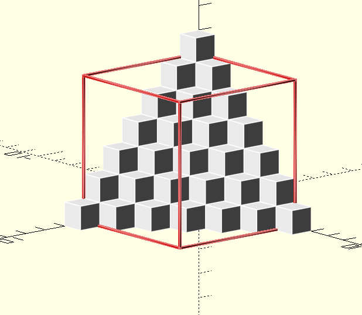

This only gets worse as we look at larger and larger rolls:

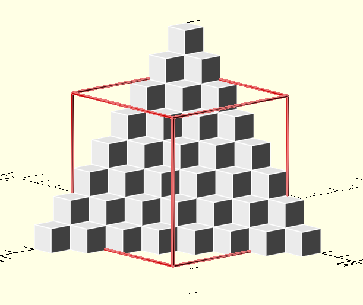

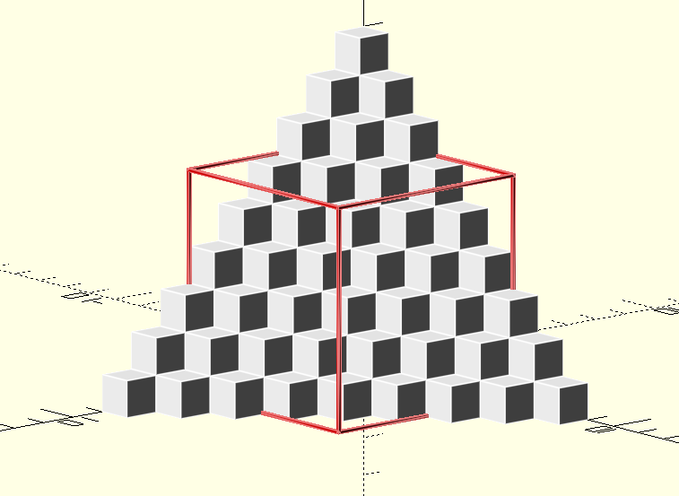

But these protrusions are themselves simplexes! So we can just subtract their volumes off. However, this gets hairy. As we continue to look at larger rolls, the protrusions will eventually overlap. Looking at a roll of 15:

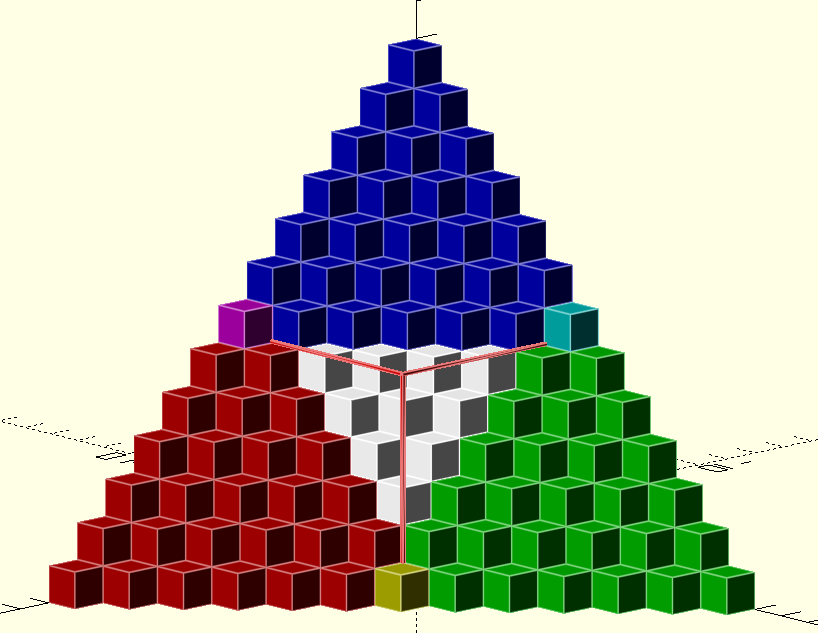

I'm running out of good high contrast colours. The protrusions in each direction begin to overlap, and so simply subtracting the protrusions off the total volume no longer works. We could add those overlaps back, which is essentially what I did in my previous attempt at this problem. However, this gets ugly fast if the dice aren't all the same; we have a better way in general. 

We think of the dice as constraining the rolls to particular sections of the axes. We can work with the constraints one at a time. So first we generate the full simplex for a particular roll (in this case rolling a 16 from 1d5 + 1d6 + 1d7):

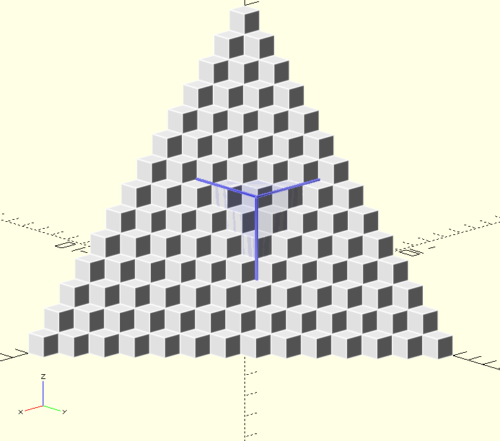

The trick is to recognize that the bits we want to cut off are themselves successively less constrained simplexes. We start by projecting the top face upward, and removing everything that gets caught in that projection. Since we are projecting in the Z direction, we no longer have to worry about constraints in that direction, only the remaining constraints in the X and Y directions:

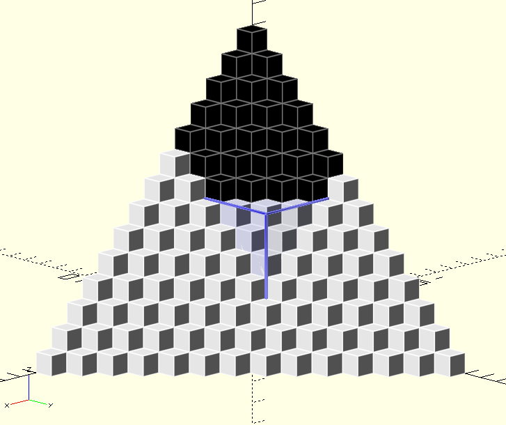

So remove that volume and proceed to another face, in this case the outer face in the Y direction. We again don't need to worry about constraints in the Y direction, but additionally we don't need to worry about constraints in the Z direction either: we took care of the volume directly on top of the prism, so there's no overlap to worry about. We do still need to worry about constraints in the X direction, however. 

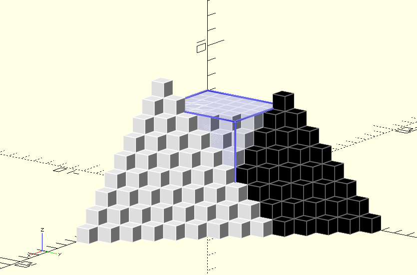

Now all the remains is the protrusion in the X direction, however with this one we don't need to worry about constraints at all, we just need to calculate its volume:

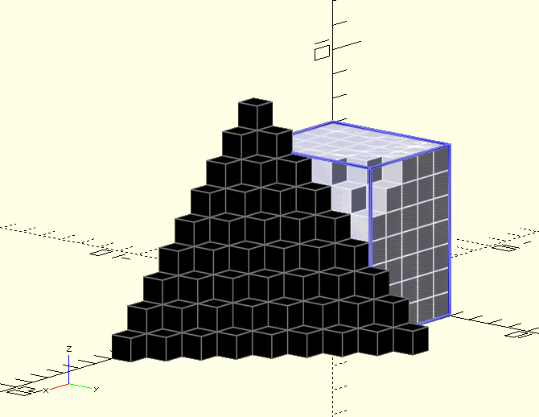

Until we're finally left with the portion of the simplex purely contained within the dimensions of our dice.

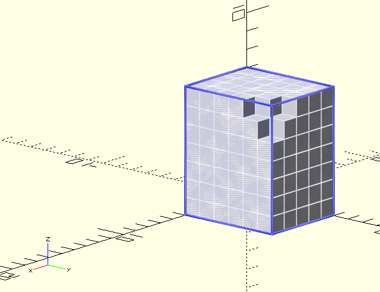

At which point we can find the probability of all rolls up to that point by dividing the volume of the truncated simplex by the volume of the prism. 

So here's how we (or at least I) design python code for this. Obviously we need a way to create unconstrainted simplex volumes. There's a straightforward relationship for that:

``` python
def simplexVolume(dim,n):
    """
    Calculates the volume of the nth simplical number of dimension dim 
    """
    if dim < 1 or n < 1:
        return 0
    p = 1
    for it in range(dim):
        p *= (n + it)/(it + 1)
    return p
```

You can also use numpy.nchoosek, or math.comb, (you'll have to adjust the inputs) but for whatever reason I found this faster. 

Then we need a function to calculate a truncated simplex volume. It should obviously be recursive. I designed this function to do that:

```python
def truncatedSimplexVolume(constraints, n, dim = None):
    if dim is None:
        dim = len(constraints)
    volume = simplexVolume(dim, n)
    for it in range(len(constraints)):
        volume -= truncatedSimplexVolume(constraints[it+1:], n-constraints[it], dim)
    return volume
```

Setting the dimension as equal to the length of the constraints (i.e. the number of the dice) if an argument isn't provided is just a convenience thing, but otherwise we want to be able to separate number of dice from the dimension: at each stage, we'll be calculating the volume of a simplex with one few constraint, but of the same dimension, so the dimension needs to be a modifiable argument.

We start by calculating the full volume of the simplex for a given roll (remember, n will be the roll - # of dice + 1) and then we iterate through the constraints subtracting off the volume of the protrusion at each stage with one fewer constraint than last time, remembering to adjust n for the protrusion (so if the constraint is 6 and we're looking at a roll of 9, the protrusion sticks out of the volume by 3).

For implementation, you're going to want to be able to cache the values of this function, and using the lru_cache tool means the inputs need to be hashable, i.e. immutable. It's important then that you give constraints in the form of a tuple. It's probably better to create a wrapper function that takes any iterable and translates it to a tuple before calling the above function just for ease of use. 

#### Some further comments

* If you look at the layer we're adding to the simplex every time we go up a roll, they're also simplical numbers, just one dimension down. Those layer volumes also correspond to the probability of getting that particular roll. In fact we can use the exact same approach above, remembering to set dim = len(constraints) - 1, to find the probability of a particular roll instead of the probability of all rolls up to some value; this is the other reason dim is a modifiable argument. I'm too lazy to make another diagram but in the 3D case you can imagine an angled triangular surface of cubes spreading out from the origin, taking up more and then less volume as it passes through and out of the prism. 

* We know these probabilities are symmetrical around the mean; it's probably better in general to only calculate values below/at the mean and adjust as needed. This effectively halves the size of the cache you need. 

* If you're looking at a case where all dice are the same, as was originally asked about, the above approach is unnecessarily slow: too many function calls, each with it's own hash to access the cache. There's a faster way I've detailed here. 

* If you want the entire roll distribution, you probably want to change up the above approach a bit. There's another equation for simplical numbers we can use:
  $$S(n,x) = \sum_{i = 1}^{x} S(n-1, i),\quad S(0,x) = 1$$
  This is, effectively, successive cumulative sums. This would be overall slower if you wanted just one value, but if you're doing the entire distribution then finding the cumulative some for the highest roll involves finding the cumulative sum for every roll. I suspect it would be much faster to do it this way, keeping the results of each cumulative sum iteration in the cache for access later. 

* All of this is slower than convolution, unless you're writing in C or Rust or Fortran and can really optimize. Especially if you're looking at the whole distribution, just use convolution. 

* The above approach does work perfectly for impossible rolls, i.e. rolling 3d6, setting the roll value to 2 will give you a probability of 0 (there are no rolls up to 2); setting a roll value of 20 gives a probability of 1: all possible rolls are contained between 0 and 20. The same is true for finding the probability of a particular roll: giving 2 and 20 as the roll both return 0.  

* Using the above approach, I can calculate the values for all possible rolls on a 100d100 in just over 23 seconds; I can calculate the value for any particular roll in about 350 milliseconds (thank goodness for caching). 
